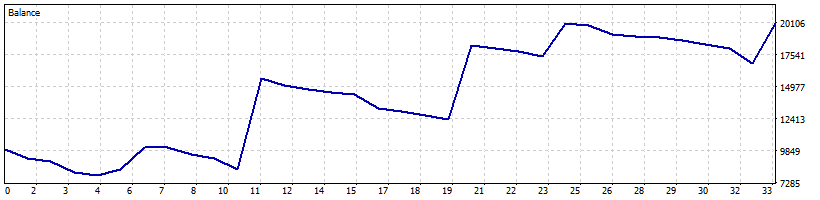

# La regla de tendencia en MetaTrader 5 (CFD con swaps)

Validación del EA **WIQON Shield** (la misma regla del punto 3 del README:
comprado si el cierre diario está sobre la SMA100; fuera si está debajo)
en el **Probador de Estrategias de MT5**, con un broker real.

## Configuración

- Broker: Exness, **cuenta demo** (servidor Exness-MT5Trial11, build 6241)
- Símbolo: **BTCUSDm** (CFD), marco **D1**, modelo "solo precios de apertura"
- Spread y **swaps reales del broker**; sin comisión aparte
- Depósito 10.000 USD, apalancamiento de la cuenta 1:100; el EA **no apalanca**
  (exposición 99% del capital)
- Historial disponible del broker: desde fines de 2021, así que la primera
  operación es del **2022-03-23**. Período: 2022-03-23 → 2026-09-25 (~4,5 años)

## Resultados

| Misma ventana | Resultado | Caída máxima |
|---|---|---|
| **EA en CFD (spread + swaps)** | **x2,02** (+10.234 USD) | 39,1% (equity) · 20,6% (balance) |
| Misma regla en BTC spot, Binance (0,1% + 0,05% slippage, sin Earn) | x2,67 | 36,7% |
| Comprar y mantener BTC | x1,96 | 66,7% |

- 33 operaciones; 21% ganadoras; factor de beneficio 1,92.
- **Swaps: −4.241 USD** en 859 días comprado (~5 USD/día por 0,23 BTC, ≈10-11%
  anual sobre lo invertido). Se llevan cerca de un tercio de la ganancia del spot.

*Eje horizontal: número de operación.*

## Control de la lógica (sin costos)

Antes, el mismo EA se corrió sobre un símbolo personalizado con las velas
diarias de Binance (2018-07-12 → 2026-09-26, sin costos): **x29,6** en MT5
contra **x31,5** en Python con la misma regla. La diferencia se explica por la
exposición del 99% y el redondeo de lotes: el EA reproduce la regla.

## Conclusión

En CFD, la regla **igualó a comprar y mantener con casi la mitad de la caída**,
pero los swaps se comen buena parte de la ventaja que tiene en spot. Si se usa
en CFD, conviene un broker o una cuenta sin swap en cripto, y probarlo antes
con los costos propios.

Operaciones completas: [`operaciones_exness_btcusdm.csv`](operaciones_exness_btcusdm.csv).

*No es asesoría financiera. Un backtest no garantiza resultados futuros.*
